# GOMICODER 17

This is a summary of my programming journey since I started learning programming in Bachillerato, until now, when I'm currently studying IMAT.

## Contents

> [1º Bachillerato](#1º-bachillerato-2019-2020) > [2º Bachillerato](#2º-bachillerato) > [1º IMAT](#1º-imat) > [2º IMAT](#2º-imat)

## 1º Bachillerato, Last Semester (2020)

- This was the first year that I started using a laptop. I had a subject called TIC, whose point was to get used to computers and their programs. We used text editors like Word, presentations like Power Point, image editors like GIMP, 3D editors like SketchUp, InkScape, etc. Here I made my [first projects][tic1-github] with a computer.
- COVID-19 contributed to make me expend more time to spend on the computer.

    

        
    

    
GIMP Covid Flier (18/03/2020)

    

        
    

    
Sketch Up Dream House (30/04/2020)

## Summer (2020)

- A crutial moment for me was when I started playing Minecraft. I was very courious learning about how to create a server, how to add mods,
  and very soon I started trying to create my own [mods][first-mcreator-tutorial]. This is the first mod I created, an item that allows you to compress multiple enchantments into a single stackable item.

    

        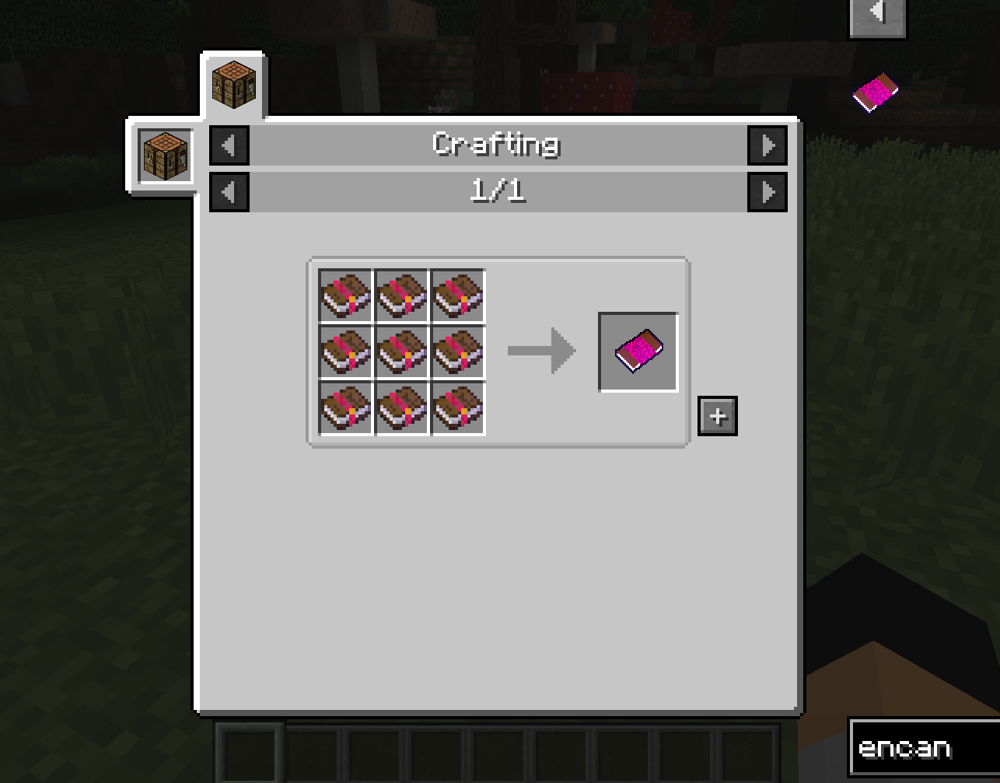
        
    

    
My first Minecraft Mod (2020-06-25)

- When I digged into the modding world, and started to look at what was inside them, I realised I needed to learn Java. So I started learning it from YouTube, with a great course of [pildorasinformaticas][first-pildorasinformaticas] channel.

- In [2020-07-12][download-eclipse] my [Java period][elipse-git] started. I spent the summer of 2020 learning Java, following the [Java Course][first-pildorasinformaticas] from pildorasinformaticas, learning the very basics of programming. I quickly forgot about the modding world, fascinated by what I could do programming.

    

        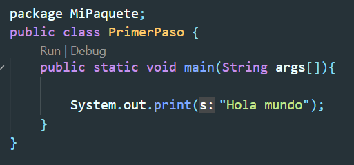
    

    
Hello World In Java (16/07/2020)

    

        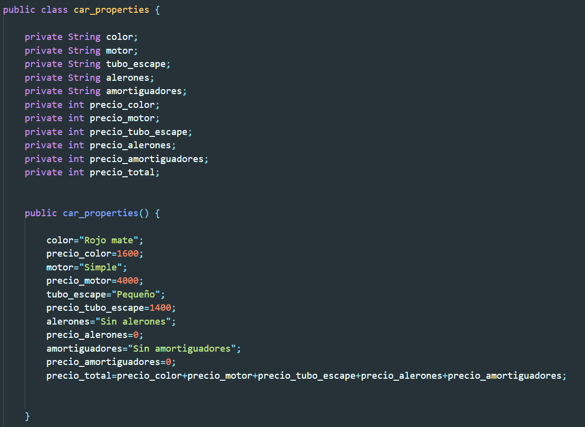
        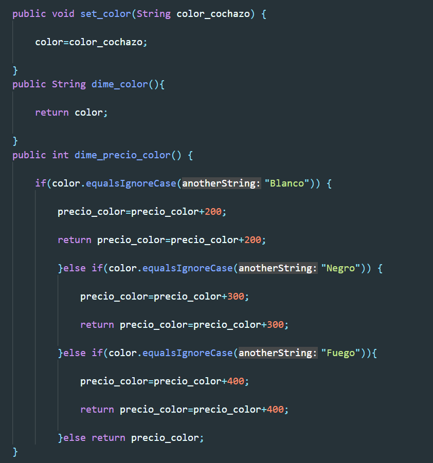
        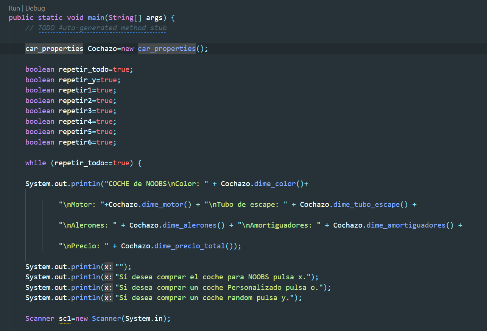
    

    
First Object Oriented Program (06/08/2020)

## 2º Bachillerato, First Trimester (2020)

- On the first trimester of 2º Bachillerato, I continued coding in Java by myself. I left the course, and started to do slightly more complex programs, challenges and games. At the end of the trimester I learned [recursion][recursion-computerphile], which was a very important concept for me. One of my first goals was to make a sudoku solver, and I tried it many times before discovering that recursion even existed.

    

        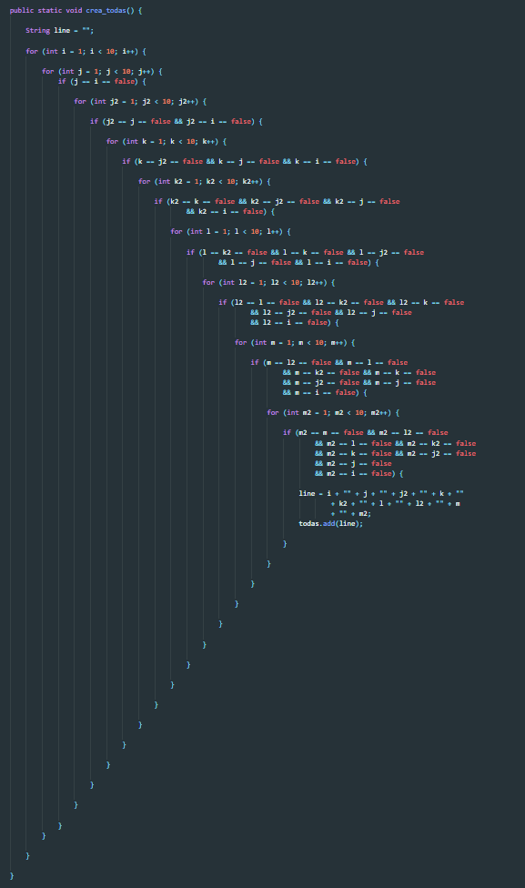
        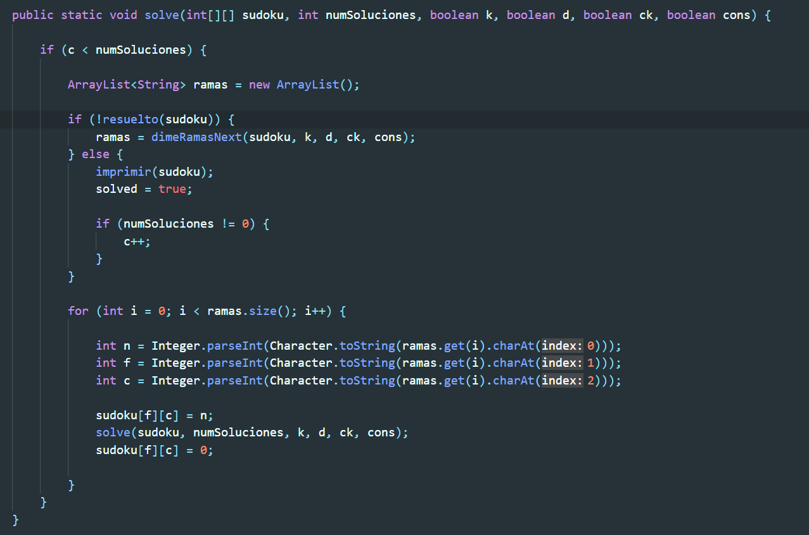
    

    
Sudoku Solver Before and After Learning Recursion (23/11/2020 vs 13/02/2021)

- At the same time, we started to learn programming in school. The first language we were taught was PSeInt, which I found like an abomination, because it was in Spanish, but what could I do? I already knew some programming, so it wasn't that hard for me.

    

        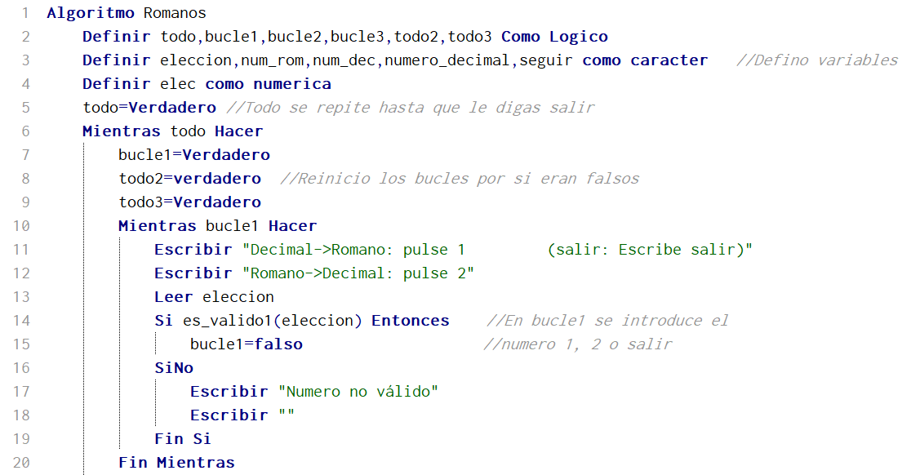
        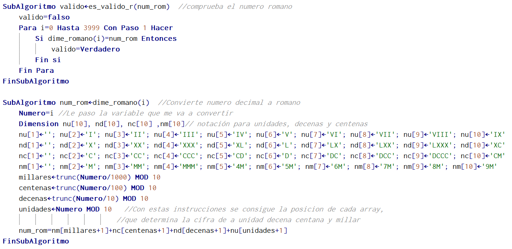
        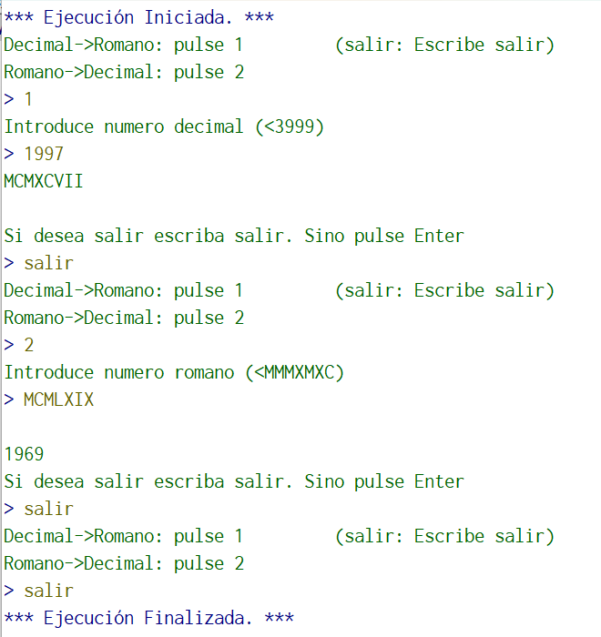
    

    
PSeInt Final Project: Decimal to Roman Converter (10/12/2020)

## 2º Bachillerato, Second Trimester (2021)

- On the second trimester of 2º Bachillerato, I started to learn `graphical programming`. I discovered one of my favourite programming youtube channels, [The Coding Train][coding-train-chnl], and I started to learn Processing in Java. Graphical programming was a very interesting experience for me, because it was the first time I was able to actually see the power of programming. It also helped me to understand Object Oriented Programming much much better.

    

        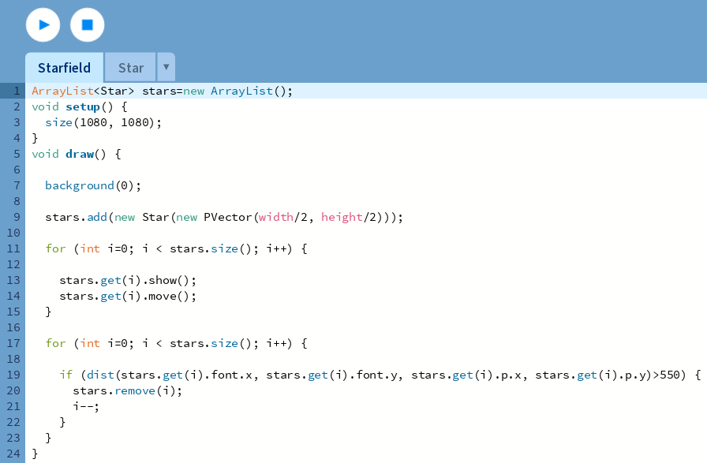
        
    

    
Starfield in Processing Java (31/01/2021)

    

        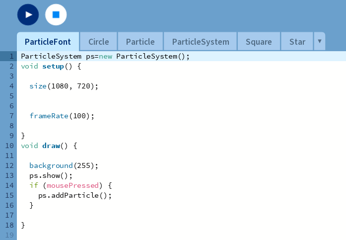
        
    

    
Particle Font in Processing Java (07/02/2021)

    

        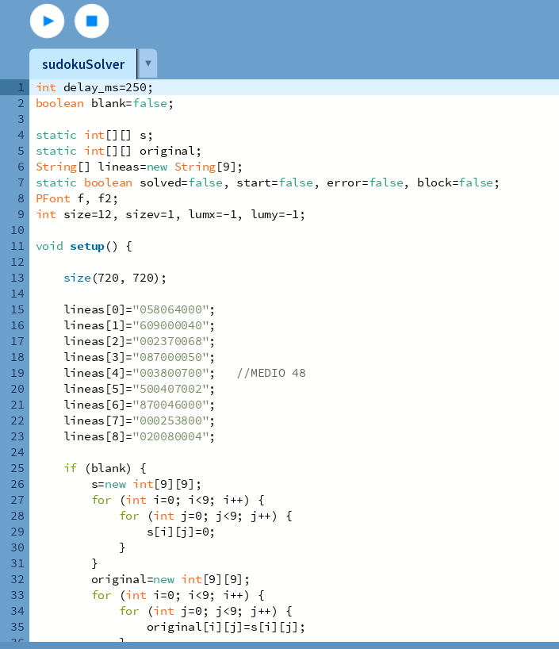
        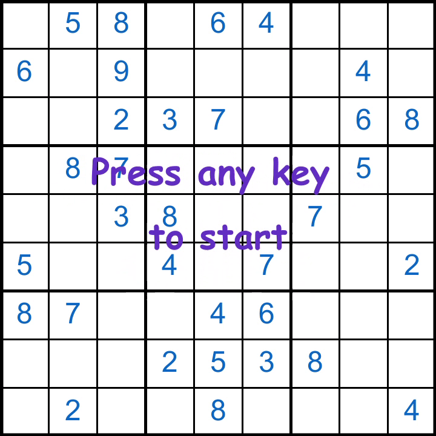
    

    
Sudoku Solver in Processing Java (16/02/2021)

- Simultaneously, in TIC class, we continued learning programming with Scratch. I dont think I learned anything, but it was fun.

    

        
    

    
Scratch Final Project: <a href="https://scratch.mit.edu/projects/790453807">Space Cowboy Skater - Invasion (7/02/2021)</a>

- After Scratch, we started to learn C. I learned only the basics, but it helped me in the future because it allowed me to optmize code in other languages using C techniques like alocating memory (in Python with arr = [0] \* n).

    

        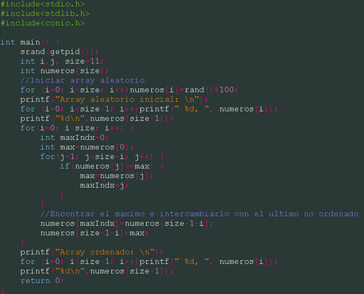
        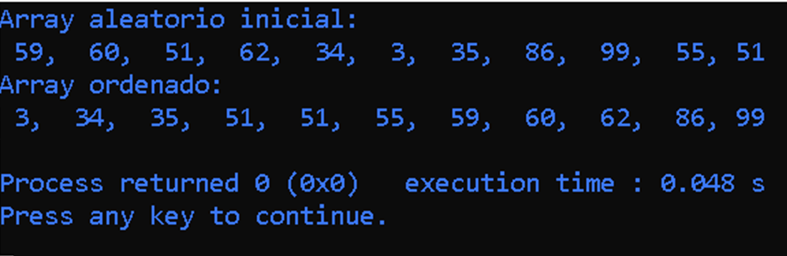
    

    
C Selection Sort (11/03/2021)

## 2º Bachillerato, Third Trimester (2021)

[first-mcreator-tutorial]: https://www.youtube.com/watch?v=7g2oQi-GGM4
[download-eclipse]: https://www.youtube.com/watch?v=F0ILFYl8YgI
[first-pildorasinformaticas]: https://www.youtube.com/watch?v=U709qY6S9rA&list=PLU8oAlHdN5BktAXdEVCLUYzvDyqRQJ2lk
[elipse-git]: https://github.com/goomii17/eclipse.git
[recursion-computerphile]: https://www.youtube.com/watch?v=G_UYXzGuqvM
[coding-train-chnl]: https://www.youtube.com/channel/UCvjgXvBlbQiydffZU7m1_aw
[tic1-github]: https://github.com/goomii17/TIC-1-Bach
